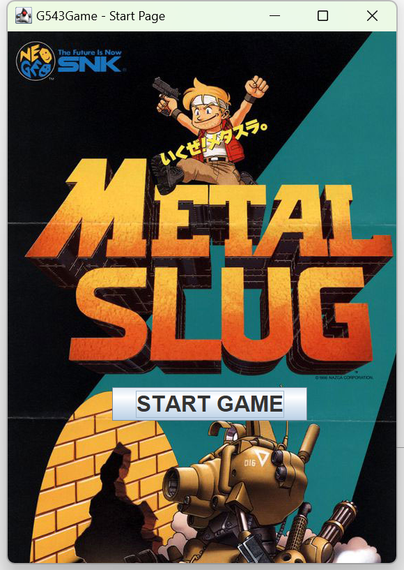
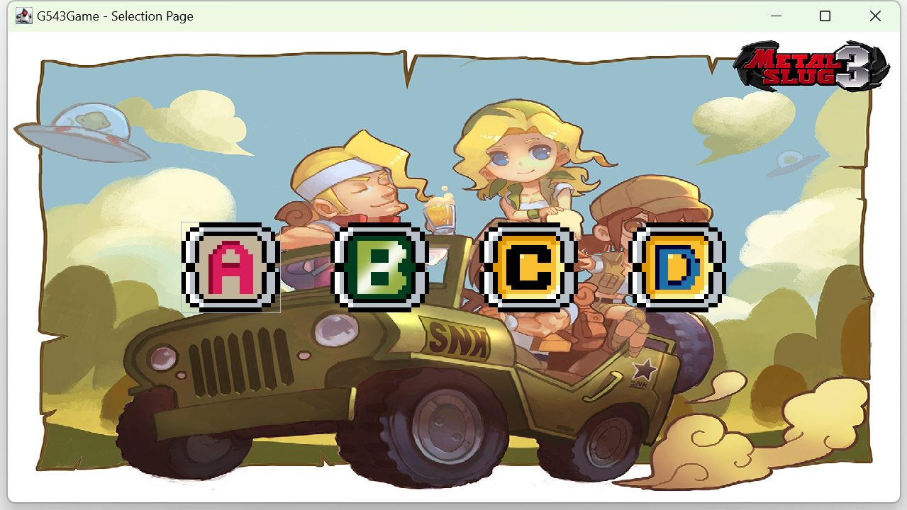
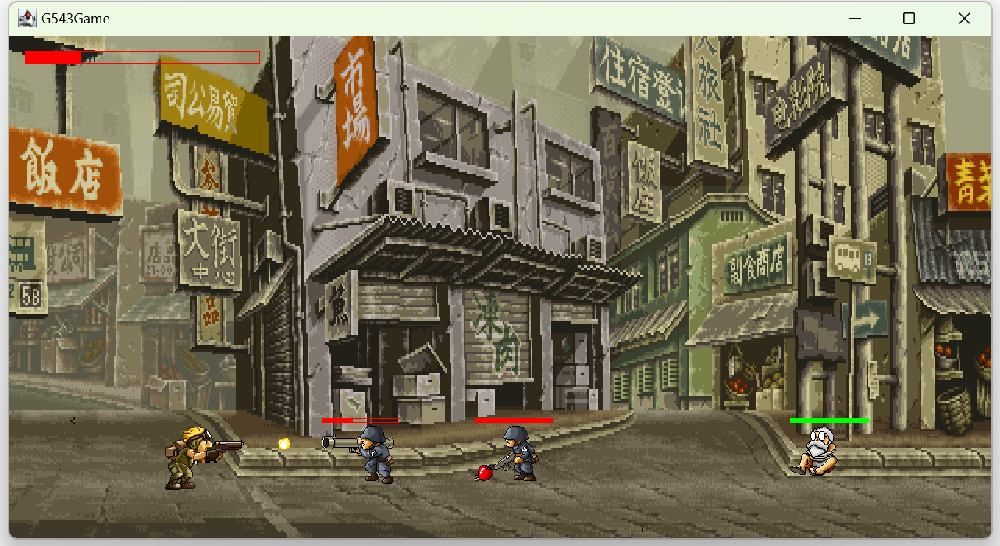
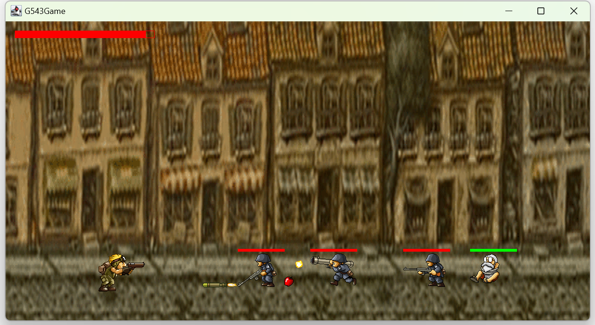
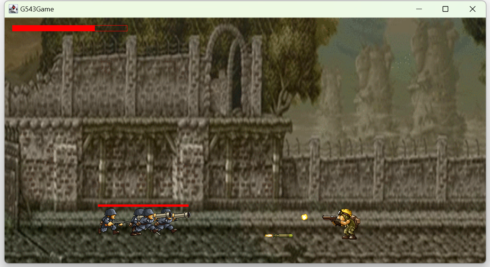
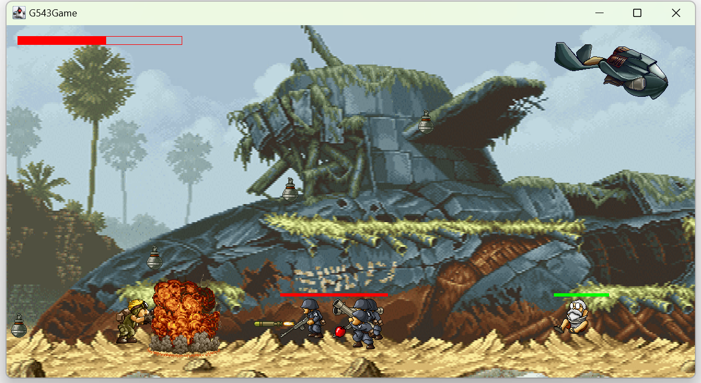
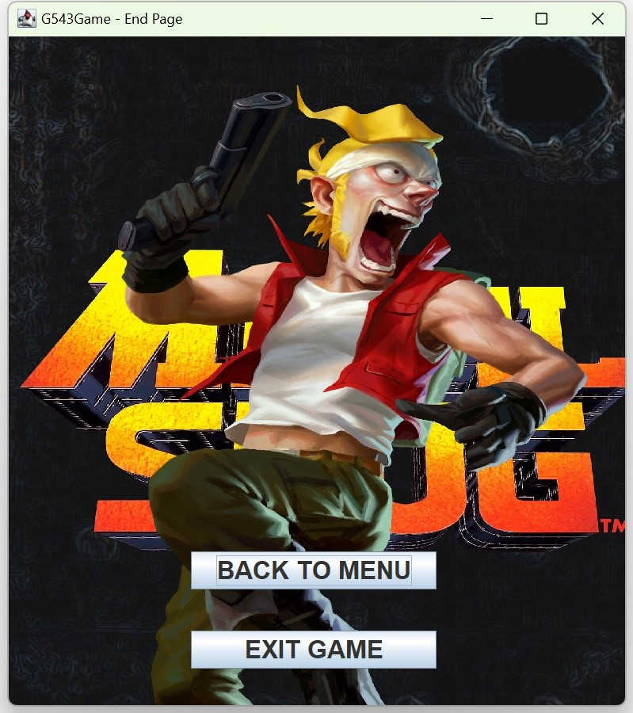
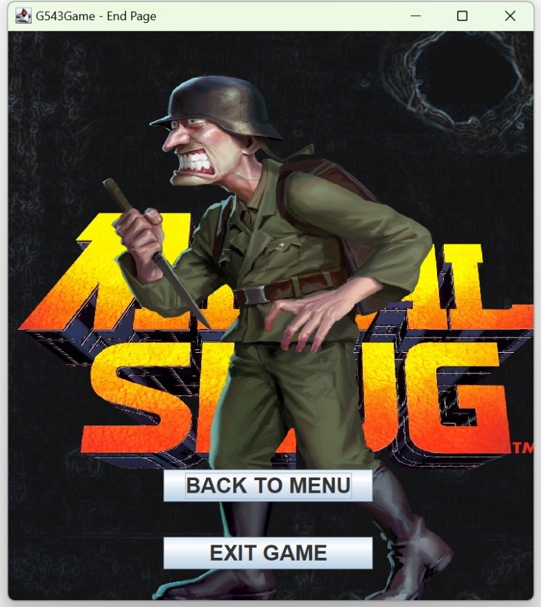
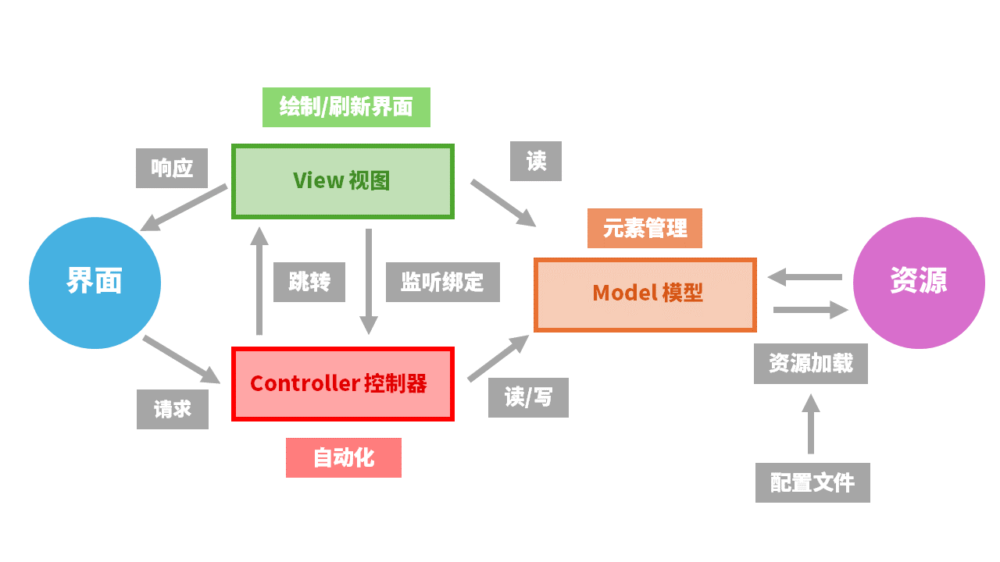

# MetalSlug合金弹头

——初级软件实作课程作业

## 主要说明

Java版本：1.8

开发平台：IDEA

运行步骤：使用IDEA打开本项目，找到G543MetalSlug\src\com\g543\g543game\game\\**GameStart.java**这个类文件，打开后在IDEA中运行该文件即可。

tips：

- 如果有报错，可能是缺少库文件，项目中使用了org.json库来读取json文件，在IDEA中导入项目根目录下lib文件夹下的jar包即可
- 本项目纯为了完成作业而写，只是完成了基本的功能而已，有需要自行copy
- 学校给的教程视频里的代码风格混乱，如果想要一个完整的框架，可以参考我们这个，把非框架的部分删掉就好了

## 按键说明

A 向左移动

D 向右移动

J 发射子弹

K 召唤增援

L 切换武器

SPACE 跳跃

## 运行图片

启动界面

选关界面

关卡A

关卡B

关卡C

关卡D

胜利结算

失败结算

MVC模式

